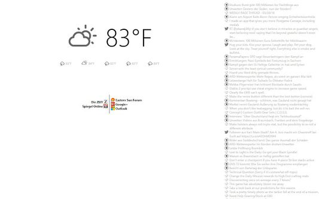

# kbo-Startpage

A customizable personal startpage featuring up to eight user-defined shortcut links and optional feed integrations from curated sources.

Install via the [Chrome Web Store](https://chrome.google.com/webstore/detail/kbo-startpage/gicgeooakklhiccdfbbdgfcgkedknjjm), [Edge Add-ons](https://microsoftedge.microsoft.com/addons/detail/kbo-startpage/piofojnppchngkbjagaejolmjldgkdle), or [Firefox Add-ons](https://addons.mozilla.org/en-US/firefox/addon/kbo-startpage/).

## Libraries Used
- [CryptoJS](https://github.com/sytelus/CryptoJS)
- [jQuery](https://jquery.com/)

## Attributions
- Weather Information provided by [Open-Meteo](https://open-meteo.com/)

## Licenses
This project is licensed under the MIT License.

Third-party dependencies are used under their respective open-source licenses.
See [Third Part Licenses](THIRD_PARTY_LICENSES.md) for license information.

## Security and Encryption
The extension does not transmit any user-provided data to the developer or to any first-party servers.
Requests to third-party data sources (such as weather APIs or RSS feeds) are made directly from the user's browser.

## Privacy Policy
The extension does not transmit any user-provided data to the developer.
All user settings are stored locally within the browser.

Note: When the extension retrieves information from external services (such as weather APIs or RSS feeds), the user's browser connects directly to those third-party servers. No additional data is sent beyond what is required to perform the request.